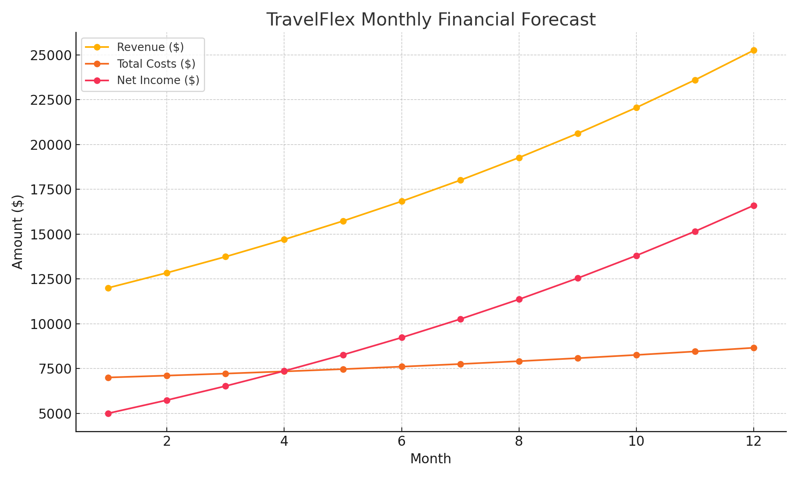

# data-analytics-projects
This is a 12-month financial forecast for a fictional travel startup called TravelFlex, built in Excel and Python. It models user growth, bookings, revenue, and expenses to project net income and cash flow.
## 📊 TravelFlex Financial Forecast

**TravelFlex** is a fictional travel startup offering flexible, last-minute bookings for hostels and co-living spaces. This project provides a 12-month financial forecast built in both **Excel** and **Python**, simulating user growth, revenue generation, operating costs, and cash flow.

### 🔧 Project Goals
- Forecast bookings and platform revenue
- Model monthly user growth and churn
- Track operating costs, net income, and cash flow
- Visualize financial trends across the year

### 🧰 Tools Used
- **Excel** – Financial model and cash flow projection
- **Python (Pandas + Matplotlib)** – Revenue simulation and visualization

### 📁 Files
- 📊 [`TravelFlex_Financial_Forecast.xlsx`](./TravelFlex_Financial_Forecast.xlsx) – Full Excel forecast
- 🐍 [`TravelFlex_Forecast_Script.py`](./TravelFlex_Forecast_Script.py) – Python simulation script
- 🖼️ [`TravelFlex_Forecast_Chart.png`](./TravelFlex_Forecast_Chart.png) – Chart of revenue, costs, and income

### 📈 Chart Preview

---

This project showcases applied financial modeling for early-stage travel startups. It’s designed to help forecast growth, understand cash runway, and evaluate business viability under real-world conditions.
