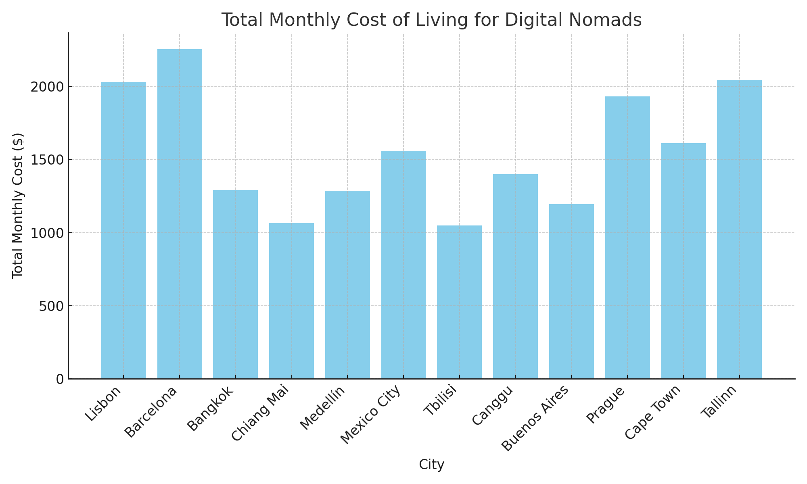
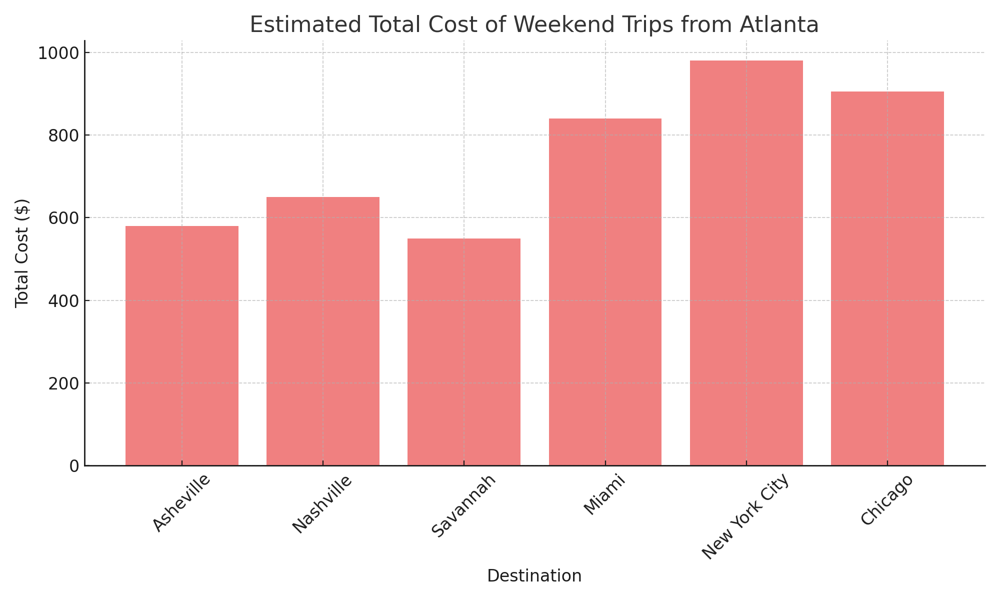

# data-analytics-projects
This is a 12-month financial forecast for a fictional travel startup called TravelFlex, built in Excel and Python. It models user growth, bookings, revenue, and expenses to project net income and cash flow.
## 📊 TravelFlex Financial Forecast

**TravelFlex** is a fictional travel startup offering flexible, last-minute bookings for hostels and co-living spaces. This project provides a 12-month financial forecast built in both **Excel** and **Python**, simulating user growth, revenue generation, operating costs, and cash flow.

### 🔧 Project Goals
- Forecast bookings and platform revenue
- Model monthly user growth and churn
- Track operating costs, net income, and cash flow
- Visualize financial trends across the year

### 🧰 Tools Used
- **Excel** – Financial model and cash flow projection
- **Python (Pandas + Matplotlib)** – Revenue simulation and visualization

### 📁 Files
- 📊 [`TravelFlex_Financial_Forecast.xlsx`](./TravelFlex_Financial_Forecast.xlsx) – Full Excel forecast
- 🐍 [`TravelFlex_Forecast_Script.py`](./TravelFlex_Forecast_Script.py) – Python simulation script
- 🖼️ [`TravelFlex_Forecast_Chart.png`](./TravelFlex_Forecast_Chart.png) – Chart of revenue, costs, and income

### 📈 Chart Preview

---

This project showcases applied financial modeling for early-stage travel startups. It’s designed to help forecast growth, understand cash runway, and evaluate business viability under real-world conditions.
## 🌍 Digital Nomad Cost of Living Comparison

This project compares the monthly cost of living across 12 popular digital nomad cities around the world. It includes key expense categories such as rent, food, coworking, internet, transportation, and lifestyle spending. The goal is to help remote workers and location-independent professionals understand how far their budget will stretch in different parts of the world.

### 🔧 Tools Used
- **Excel** – Structured cost model and dataset
- **Python (Pandas + Matplotlib)** – Data processing and chart visualization

### 📊 Key Insights
- Cities like **Chiang Mai**, **Medellín**, and **Bangkok** offer strong affordability with total monthly costs below $1,300.
- Western European cities such as **Lisbon** and **Barcelona** have higher costs, driven mainly by rent and lifestyle expenses.
- A city’s coworking and internet costs are fairly consistent, but lifestyle spending varies widely depending on local culture and services.

### 📁 Files
- 📄 [`Digital_Nomad_Cost_Comparison.xlsx`](./Digital_Nomad_Cost_Comparison.xlsx) – Full cost breakdown per city
- 📊 [`Nomad_Cost_Comparison_Chart.png`](./Nomad_Cost_Comparison_Chart.png) – Bar chart visualizing total monthly cost by city

### 📈 Chart Preview

## 🧳 Weekend Travel Planner – Budget Forecast Tool

This project helps travelers estimate the total cost of a weekend getaway from Atlanta to various U.S. destinations. It supports both car and flight-based travel and breaks down expenses across transportation, lodging, food, and activities to make budget-conscious travel decisions easier.

### 🔧 Tools Used
- **Python (Pandas)** – Data processing and cost modeling
- **Excel** – Output formatting and scenario planning
- **Matplotlib** – Visualization of trip cost comparisons

### ✈️ Destinations Covered
- **Car Trips:** Asheville, Nashville, Savannah
- **Flight Trips:** Miami, New York City, Chicago

### 💰 What's Included in the Cost Breakdown
- 🚗 **Transport:** Round-trip gas or average flight cost
- 🏨 **Lodging:** Two-night hotel or Airbnb
- 🍽️ **Food & Drinks:** Daily budget × trip length
- 🎟️ **Activities:** Fixed entertainment or experience budget
- 💵 **Total Cost:** Combined estimate for easy budget comparison

### 📁 Files
- 📄 [`Weekend_Travel_Planner.xlsx`](./Weekend_Travel_Planner.xlsx) – Estimated costs for 6 weekend destinations
- 🐍 [`Weekend_Travel_Planner.py`](./Weekend_Travel_Planner.py) – Script to generate cost estimates
- 📊 [`Weekend_Trip_Cost_Chart.png`](./Weekend_Trip_Cost_Chart.png) – Bar chart comparing total trip costs

### 📈 Chart Preview

This project is ideal for weekend travelers and remote workers planning short, budget-friendly getaways.
